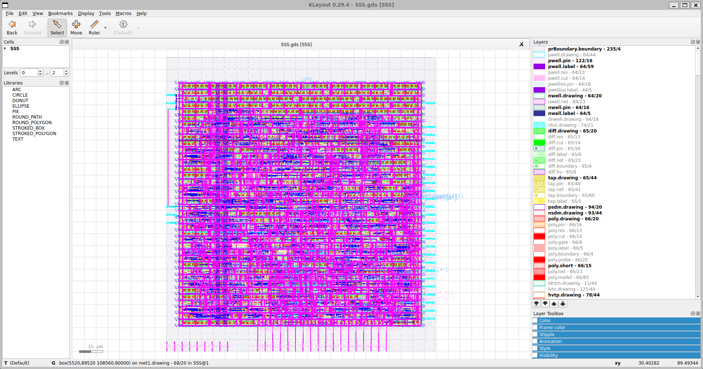

# Security-Safe-System
# FPGA-to-ASIC Security Safe System with OpenLane 2

An end-to-end digital IC design project showcasing the full hardware development workflow: from RTL design and FPGA board prototyping to GDSII layout generation using the modern **OpenLane 2** automated ASIC flow.

[![Demonstration Video]](https://drive.google.com/file/d/1i7IdgV22Mklluz0pu65EqNwhIhOL5bG_/view?usp=sharing)

---

## Project Overview

This project implements a hardware-level **Security Safe System** featuring robust password enforcement and anti-intrusion mechanisms. While the core logic serves as a functional vehicle, the primary objective is to demonstrate proficiency in handling the gap between FPGA emulation and physical ASIC implementation (RTL-to-GDSII).

### Key Features
*   **Dual Operational Modes:** Supports autonomous Password Modification and Password Verification states.
*   **Weak-Password Interception:** Hardware-level filtering logic that automatically rejects predictable patterns (e.g., `11111111`, `10101010`) using parallel combinational comparators.
*   **Intrusion Defense & Penalty Enforcement:** A synchronous Finite State Machine (FSM) tracks unauthorized access attempts, triggering visual penalty feedback (LED decay and RGB warning states) and enforcing a security lock-out timeout.
*   **Rich Visual UI:** Custom 2-second scrolling marquee animation, state blinking, and real-time perimeter status updates on peripheral displays.

---

## Hardware Prototyping (FPGA)

The design was first validated via hardware-in-the-loop testing to ensure functional correctness under real-world timing constraints.

*   **Development Board:** Digilent Nexys A7 (Xilinx Artix-7 FPGA)
*   **Peripherals Utilized:** 16x Slide Switches, 16x Overhead LEDs, Tri-color RGB LED, 7-Segment Display (Marquee & Blink controllers), Push Buttons.
*   **Verification:** Verified error-handling states, FSM state-bouncing behavior, and visual/timing delay constraints under a 100MHz system clock.

---

## ASIC Implementation Flow (OpenLane 2)

The verified RTL was pushed through the open-source **OpenLane 2** cloud-based EDA toolchain to generate the final physical layout. 

### Implementation Highlights
*   **Synthesis & Logic Optimization:** Handled via Yosys.
*   **Floorplanning & Placement:** Optimized core utilization and IO pin placement for timing convergence.
*   **Clock Tree Synthesis (CTS) & Routing:** Executed via OpenROAD to eliminate setup/hold violations.
*   **Sign-off Verification:** Passed full Design Rule Checking (DRC) and Layout Versus Schematic (LVS) checks.

### Design Metrics & Physical Results
Below is a summary extracted from `metrics.json` after the sign‑off stage:

| Metric | Value / Result |
| :--- | :--- |
| **Target PDK** | SkyWater sky130 / IHP sg13g2 (select as applicable) |
| **Core Utilization** | ~53% |
| **Die Area** | 0.0143 mm² (≈14,327 µm²) |
| **Core Area** | 0.01065 mm² (≈10,650 µm²) |
| **Gate Count (Std Cells)** | 720 |
| **Sequential Cells** | 80 |
| **Combinational Cells** | 370 |
| **Clock Buffers / Inverters** | 10 / 6 |
| **Worst Negative Slack (WNS)** | 0 ns (timing met across all corners) |
| **Clock Skew (worst)** | ±0.26 ns |
| **Fanout Violations** | 3 (persistent across corners) |
| **Slew / Cap Violations** | 0 |
| **Power (Total)** | ~0.00075 W (internal + switching, leakage negligible) |
| **Routing Wirelength** | ~10,748 µm |
| **Routing Vias** | 3,945 (all single‑cut) |
| **Routing DRC Errors** | 0 (clean after iteration 5) |
| **Antenna Violations** | 0 |
| **Disconnected Pins** | 9 (none critical) |
| **IR Drop (worst)** | ~0.000685 V |
| **Power Grid Drop (worst)** | ~0.000685 V |
| **DRC / LVS Violations** | 0 / 0 (clean) |
| **XOR Differences** | 0 |
| **Magic / KLayout DRC Errors** | 0 / 0 |

---

## Repository Structure

```text
├── SSS/                  # Main project directory
│   ├── src/              # Source code files
│   ├── SSS.sv            # SystemVerilog design file
│   └── config.json       # Configuration settings
├── demo/                 # Demo materials and examples
│   ├── README.md         # Documentation for demo usage
├── final/                # Final sign-off outputs or deliverables
├── gds/                  # Layout and design files
│   ├── SSS.gds           # GDSII layout file
│   ├── SSS.png           # Image preview of layout
├── README.md             # Main project documentation
└── metrics.json          # Performance and metrics data
```

---

## Demonstration & Media

Due to GitHub's file size limitations, the full high-definition demonstration video (260 MB) is hosted externally. 

*   **[Watch the Full Demo Video on Google Drive](https://drive.google.com/file/d/1i7IdgV22Mklluz0pu65EqNwhIhOL5bG_/view?usp=sharing)**

### GDSII Layout Preview
*Below is the final synthesized silicon layout generated by the OpenLane 2 flow:*



---

## Key Engineering Takeaways
1.  **Clock & Reset Strategies:** Managed the architectural transition from FPGA-specific board global clock buffers to standard cell library clock trees in ASIC.
2.  **Physical Design Constraints:** Establish appropriate `config.json` parameters in OpenLane 2 to guarantee successful routing without congestion issues.
3.  **Timing Closure:** Optimized critical paths within FSM transition logic, validating timing closure through OpenLane STA metric reports.
